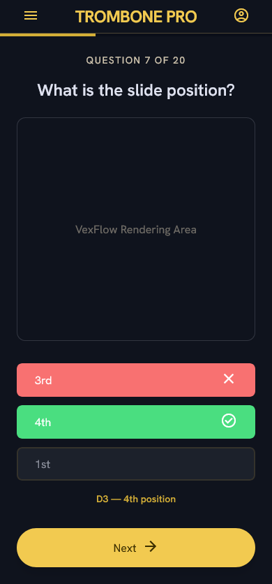

# Trombone Flash Cards

A mobile-first web quiz that drills beginner trombone players on note names and slide positions. You're shown a note on a bass clef staff and asked to identify either the note name or its slide position from three choices. Twenty questions per round, immediate feedback after each answer, results summary at the end.



## What it covers

- **Note range:** F2 to C4 (natural notes plus B♭ and E♭ — 15 pitches)
- **Question types:** Name Questions (identify the note) and Position Questions (identify the slide position), balanced 10/10 per round
- **Canonical positions:** one authoritative slide position per note, the lowest-numbered position as taught in method books
- **Distractors:** the two nearest neighbours to the correct answer, shuffled into a random display order each time

## Tech stack

| Concern | Choice |
|---|---|
| Framework | React 19 |
| Build toolchain | [Vite+](https://viteplus.dev) (`vp` CLI) |
| Package manager | pnpm |
| Language | TypeScript |
| Styling | CSS Modules — no Tailwind |
| Staff notation | [VexFlow 5](https://www.vexflow.com) |
| Testing | Vitest + Testing Library |

## Project structure

```
src/
├── data/
│   └── notes.ts          # Note Range, canonical positions, distractor logic (pure TS)
├── engine/
│   ├── round.ts          # generateRound() — builds a shuffled 20-question Round
│   └── quizState.ts      # Pure reducer: welcome → playing → feedback → summary
├── components/
│   ├── WelcomeScreen/    # Intro screen with Play button
│   ├── QuizScreen/       # Quiz interaction (active + feedback states)
│   ├── StaffDisplay/     # VexFlow bass clef renderer
│   └── SummaryScreen/    # Result display with Play Again
├── styles/
│   └── tokens.css        # Brass & Shadow design tokens as CSS custom properties
├── App.tsx               # Screen state machine (useReducer → screen switch)
└── main.tsx              # React root
```

The three modules in `src/data/` and `src/engine/` are pure TypeScript with no React or DOM dependency — they hold all the domain logic and are fully unit tested. The components are thin wrappers that render state and dispatch actions.

## Getting started

```bash
# Install dependencies
vp install

# Start the dev server
vp dev
```

Then open [http://localhost:5173](http://localhost:5173).

## Development workflow

```bash
# Run the full check suite (format, lint, type check)
vp check

# Run tests
vp test

# Fix formatting issues automatically
vp check --fix

# Production build
vp build
```

The project uses Vite+'s staged check, so `vp check` runs automatically on staged files before each commit.

## Design system

The visual design is **Brass & Shadow** — a dark navy base (`#0f131d`) with brass gold accents (`#f2ca50`) and the Hanken Grotesk typeface. Full token reference is in [`docs/design/brass_shadow/DESIGN.md`](docs/design/brass_shadow/DESIGN.md). Screen designs are in [`docs/design/`](docs/design/).

All CSS uses the tokens defined in `src/styles/tokens.css` as custom properties (e.g. `--color-primary`, `--spacing-touch-target-min`). Never hardcode colours or spacing values directly.

## Architecture decisions

Key decisions are recorded in [`docs/adr/`](docs/adr/):

| ADR | Decision |
|---|---|
| [0001](docs/adr/0001-balanced-question-type-split.md) | Balanced 10/10 question type split per round |
| [0002](docs/adr/0002-static-svg-staff-rendering.md) | ~~Static SVG staff rendering~~ (superseded) |
| [0003](docs/adr/0003-react-ui-framework.md) | React as UI framework |
| [0004](docs/adr/0004-css-modules-for-styling.md) | CSS Modules — Tailwind explicitly rejected |
| [0005](docs/adr/0005-vexflow-staff-rendering.md) | VexFlow for staff notation |

## Domain glossary

See [`CONTEXT.md`](CONTEXT.md) for the canonical vocabulary used throughout the codebase: Note, Note Range, Canonical Position, Question, Choice, Distractor, Round, Feedback, and the three screens.

## Issue tracker

Issues are tracked as local markdown files under [`.scratch/trombone-flash-cards/`](.scratch/trombone-flash-cards/). The PRD lives at [`.scratch/trombone-flash-cards/PRD.md`](.scratch/trombone-flash-cards/PRD.md).
